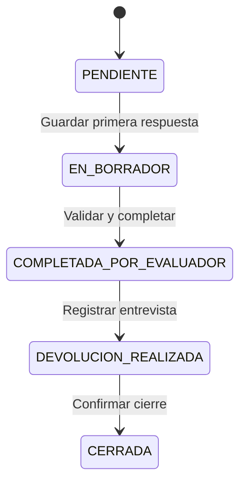

# Etapa 1. Modelo de Evaluación de Desempeño HP3C

## Alcance de esta entrega

Estructura inicial del módulo EDD del Sistema de Gestión RRHH. Incluye el modelo funcional, pantallas navegables, controles de acceso, diseño de información y especificación de implementación. La carga de períodos, asignaciones, respuestas y cierres se desarrollará sobre esta estructura. Las pantallas iniciales muestran estados vacíos, sin presentar ejemplos como resultados institucionales.

Se conserva la rama de trabajo `FRAN240926`. Cada etapa tiene su propio commit. No se integra a `main`.

## Decisiones para EDD 2026

- Institución: Hospital Privado Tres Cerritos.
- Escala confirmada por el usuario: **1 a 4**. Los reportes deben mostrar resultados sobre 4.
- RRHH configura período, población, instrumento, escala, ponderaciones, responsables, fechas y excepciones.
- Cada evaluador ingresa a su equipo asignado. No elige personas desde la nómina general.
- Una evaluación principal por colaborador y período, con un responsable vigente. La reasignación conserva el historial.
- La autoevaluación conserva sus propias respuestas y comentarios. No reemplaza ni promedia automáticamente el puntaje del evaluador.
- Devolución y cierre son pasos diferentes. Una evaluación completada por el evaluador todavía no está finalizada.
- El puesto/rol y el servicio determinan el contexto del instrumento. La categoría de liquidación no equivale al puesto.

## Referencia EDD 2025

Se consultó la planilla aportada, sin modificarla ni incorporar evaluaciones personales al repositorio. Su contenido se usa como referencia del instrumento; sus instrucciones internas no son órdenes para ejecutar acciones.

| Hoja y rango | Evidencia utilizada |
| --- | --- |
| `Escala de Evaluación!B5:C8` | Cuatro niveles con descripción de comportamiento esperado. |
| `EDD 2025!B9:J9` | Identificación del evaluado, legajo, área, rol y evaluador. |
| `EDD 2025!C12:J17` | Competencias organizacionales, autoevaluación, evaluación y comentarios separados. |
| `EDD 2025!C21:J26` | Competencias funcionales específicas de Administración. |
| `EDD 2025!B32:J37` | Ponderaciones y resultados por bloque. No se trasladan automáticamente sus fórmulas a 2026. |
| `EDD 2025!B39:J45` | Retroalimentación y espacios de firma del líder y del colaborador. |
| `EDD 2025!B52:J58` | Necesidades de capacitación y plan de acción. |
| `INSTRUCTIVO!B7:B13` | Autoevaluación, evaluación, calibración, devolución y seguimiento. |
| `Competencias Organizacionales!B4:G25` | Comportamientos observables según nivel de responsabilidad. |
| `Competencias Funcionales!C5:M5` | Referencias a diferentes servicios. |

La calibración, el umbral de seguimiento y las firmas del antecedente 2025 requieren definición funcional para 2026. No agregan estados obligatorios al flujo solicitado. El diccionario organizacional debe revisarse antes de publicarlo: por ejemplo, `F20:G20` rotula “En desarrollo” con 3, aunque la escala lo define con 2. No se importa como catálogo aprobado.

## Instrumento

| Bloque | Contenido |
| --- | --- |
| Competencias generales | Base organizacional común: ética profesional, trabajo en equipo colaborativo, compromiso con el propósito, orientación al paciente/cliente y excelencia operativa. |
| Competencias específicas | Criterios según rol, servicio y versión del descriptivo de puesto. |
| Desempeño | Cumplimiento de tareas, calidad y resultados del puesto. |
| Conductas | Comportamientos observables con ejemplos y evidencias. Evitar puntuar dos veces el mismo criterio. |
| Objetivos | Metas del período, indicadores, evidencia y criterio de cumplimiento. |

Cada ítem tendrá descripción, orden, obligatoriedad, aplicabilidad y peso. RRHH define qué bloques se utilizan y sus ponderaciones. Los pesos activos deben sumar 100 %. No hay pesos predeterminados en esta etapa.

| Valor | Concepto |
| --- | --- |
| 1 | Por debajo de lo esperado |
| 2 | En desarrollo |
| 3 | Cumple con lo esperado |
| 4 | Supera las expectativas |

Los puntajes deben ser valores numéricos permitidos por la versión de escala, nunca texto extraído de una etiqueta. Un ítem sin contestar no vale cero. Si se habilita “No aplica”, requiere motivo y una regla explícita de redistribución de pesos.

## Flujo principal

La autoevaluación tiene un avance independiente: pendiente, borrador y enviada. La entrevista registra fecha, participantes, fortalezas, aspectos a desarrollar, acuerdos y plan de acción. El cierre requiere que estén satisfechas las condiciones del período y deja el contenido de solo lectura.

Las correcciones excepcionales requieren permiso de RRHH, motivo, autor y fecha. Una reapertura debe preservar la versión cerrada y definir si invalida la devolución o las constancias previas.

## Tres niveles de trabajo

1. **Configuración RRHH:** período, población activa al corte, evaluadores, instrumento y reglas.
2. **Jefaturas:** equipo asignado, borradores, evaluación, devolución y cierre.
3. **Gestión estratégica RRHH:** cobertura, avance, resultados por competencia/área y evolución histórica.

La autoevaluación es el acceso personal del colaborador y no concede acceso a otras personas.

## Indicadores

- Previstas: evaluaciones incluidas en el período, descontando exclusiones aprobadas.
- Pendientes: estado `pendiente`.
- En proceso: `borrador`, `completada_evaluador` y `devolucion_realizada`.
- Finalizadas: exclusivamente `cerrada`.
- Avance: cerradas / previstas × 100. Sin población, se muestra “Sin evaluaciones asignadas”, no 0 % de avance institucional.
- Puntaje por bloque: promedio ponderado de ítems aplicables y completos.
- Puntaje global: suma de los resultados de bloque multiplicados por sus pesos normalizados.
- Promedio hospital/área: promedio de puntajes finales de evaluaciones cerradas y comparables, indicando cantidad y escala. No se promedian promedios de áreas sin ponderar por cantidad.
- Fortalezas y oportunidades: competencias con mayor/menor promedio, mostrando cobertura. Sin resultados comparables, el indicador queda sin datos.

## Definiciones pendientes antes de habilitar la carga

Fechas y corte de población; ponderaciones; criterios por puesto; obligatoriedad y fechas de autoevaluación; calibración; evidencia de devolución; firma o constancia; exclusiones, suplencias y reaperturas; umbral de seguimiento y reglas de comparación entre versiones. Estas decisiones no impiden revisar la estructura navegable.
