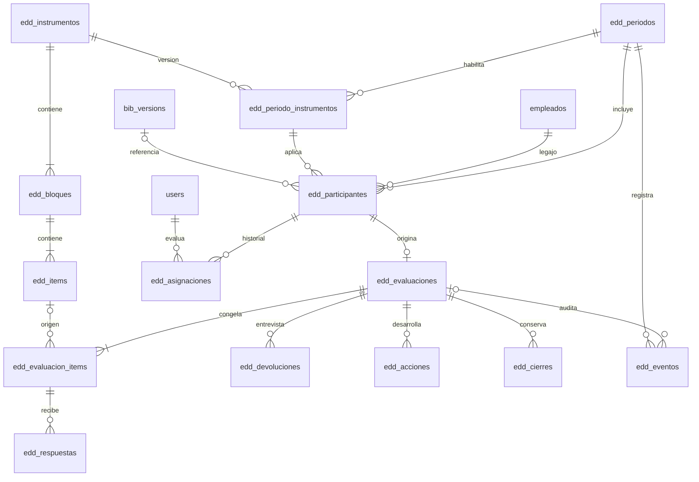

# Etapa 3. Modelo de información

## Estado y convenciones

Diseño para la persistencia posterior. Esta etapa no crea tablas ni ejecuta migraciones. Las pantallas entregadas funcionan sin tablas EDD. Antes de escribir migraciones se verificarán tipos, índices y claves de las tablas institucionales en el ambiente de desarrollo; las migraciones históricas de Laravel no describen por completo la nómina actual.

Tablas nuevas con prefijo `edd_`, claves propias `id` y fechas de auditoría. Los identificadores de usuario, legajo y documentos existentes conservarán sus tipos reales. Los importes de ponderación y los resultados usan decimales, nunca flotantes binarios para almacenamiento. Los instantes se guardan en UTC y se muestran en `America/Argentina/Buenos_Aires`; las fechas de corte y vencimiento son fechas locales.

## Relaciones existentes verificadas en el código

| Fuente | Identidad y relación | Uso EDD |
| --- | --- | --- |
| `users` | `id`, `legajo`, `rol`, `estado` | Cuenta que actúa y su vínculo con el colaborador. |
| `empleados` | `LEGAJO`, `COLABORADOR`, `ESTADO`, `ID_SERVICIOS`, `ID_ROL`, `ID_CATEG`, `CONVENIO` | Población y contexto laboral. El estado activo utilizado por el sistema es `ACTIVO`. |
| `servicios` | `ID_SERVICIOS`, `NOMBRE` | Servicio del puesto. |
| `rol_empleados` | `ID_ROL`, `NOMBRE` | Función/puesto, independiente del perfil de acceso. |
| `categ_empleados` | `ID_CATEG` | Categoría convencional; no define por sí sola competencias específicas. |
| `areas` | `ID_AREA` según `App\Models\Area` | Área de reporte. Verificar la relación real con servicio/colaborador antes de resolverla. |
| `bib_employee_documents` | `legajo`, `document_id` | Descriptivo individual. |
| `bib_category_documents` | `category_id`, `document_id` | Compatibilidad con asignación anterior por categoría. |
| `bib_documents`, `bib_versions` | Documento y versión publicada/validada | Fuente del descriptivo que contextualiza la evaluación. |

La resolución del descriptivo debe reutilizar el criterio de Biblioteca: asignación individual prioritaria y compatibilidad con asignaciones por categoría. La copia histórica EDD no debe depender de qué versión sea vigente al consultar un año anterior. No debe exigirse una firma del descriptivo como permiso para evaluar salvo regla expresa del período.

Fuentes locales: `App\Services\Biblioteca\Assignments`, `App\Services\Biblioteca\Acceptances` y `docs/CATEGORIAS_SERVICIOS_Y_DESCRIPTIVOS.md`.

## Relaciones del módulo



## Período e instrumento

| Tabla | Campos principales | Restricciones |
| --- | --- | --- |
| `edd_periodos` | `id`, `codigo`, `nombre`, `anio`, `estado`, `fecha_corte`, `inicio_evaluacion`, `fin_evaluacion`, `inicio_autoevaluacion`, `fin_autoevaluacion`, `limite_devolucion`, `reglas_json`, `revision`, `created_by`, `updated_by`, fechas | `codigo` único. Estado del período: borrador, habilitado, cerrado. Orden temporal válido. Reglas completas antes de habilitar. |
| `edd_instrumentos` | `id`, `codigo`, `version`, `nombre`, `estado`, `escala_json`, `reglas_calculo_json`, `publicado_at`, `publicado_by`, `revision`, fechas | Único (`codigo`, `version`). Una fila identifica una versión. Publicado es inmutable; los cambios crean otra versión. |
| `edd_bloques` | `id`, `instrumento_id`, `codigo`, `nombre`, `descripcion`, `peso_porcentaje`, `orden`, `activo` | Único (`instrumento_id`, `codigo`). Pesos positivos en activos; suma de activos 100 % al publicar. |
| `edd_items` | `id`, `bloque_id`, `codigo`, `competencia_codigo`, `tipo`, `titulo`, `descripcion`, `conductas_json`, `criterio_cumplimiento_json`, `peso_relativo`, `obligatorio`, `permite_no_aplica`, `orden` | Único (`bloque_id`, `codigo`). Tipos competencia, desempeño, conducta, objetivo. Código de competencia estable para comparar versiones equivalentes. |
| `edd_periodo_instrumentos` | `id`, `periodo_id`, `instrumento_id`, `criterio_aplicacion_json` | Único (`periodo_id`, `instrumento_id`). Solo versiones publicadas al habilitar el período. |

`escala_json` conserva los valores 1–4 y sus definiciones confirmadas para 2026. Las reglas de cálculo incluyen precisión, aplicabilidad y tratamiento de objetivos. Las reglas del período incluyen obligatoriedad/visibilidad de autoevaluación, condiciones de devolución/cierre y excepciones permitidas. No se habilita un período con reglas ambiguas.

Los criterios de aplicación sugieren instrumentos por servicio/rol. La asignación efectiva del participante es explícita; si coinciden dos reglas, RRHH resuelve el caso antes de abrir la evaluación.

## Población, asignación y evaluación

| Tabla | Campos principales | Restricciones |
| --- | --- | --- |
| `edd_participantes` | `id`, `periodo_id`, `legajo`, `periodo_instrumento_id`, `incluido`, `motivo_excepcion`, `descriptivo_version_id`, `contexto_snapshot_json`, `revision`, autores y fechas | Único (`periodo_id`, `legajo`). El instrumento debe pertenecer al mismo período. Excluir exige motivo. |
| `edd_asignaciones` | `id`, `participante_id`, `evaluador_user_id`, `funcion`, `equipo_nombre`, `vigente_desde`, `vigente_hasta`, `current_slot`, `motivo`, `created_by`, `created_at` | Único (`participante_id`, `current_slot`), con 1 en la vigente y NULL en las anteriores. Un solo responsable vigente. Usuario activo y distinto del evaluado. |
| `edd_evaluaciones` | `id`, `participante_id`, `estado`, `autoevaluacion_estado`, `comentario_evaluador`, `comentario_colaborador`, `fortalezas`, `aspectos_desarrollar`, `completada_at`, `completada_by`, `autoevaluacion_enviada_at`, `autoevaluacion_enviada_by`, `ciclo`, `revision`, autores y fechas | `participante_id` único. `estado` usa los códigos del enum. `ciclo` comienza en 1 y aumenta con reaperturas. `revision` aumenta en cada modificación. |
| `edd_evaluacion_items` | `id`, `evaluacion_id`, `item_origen_id` nullable, `bloque_codigo`, `competencia_codigo`, `codigo`, `tipo`, `titulo`, `descripcion`, `conductas_json`, `criterio_cumplimiento_json`, `peso_bloque`, `peso_relativo`, `obligatorio`, `permite_no_aplica`, `orden` | Único (`evaluacion_id`, `codigo`). Copia efectiva del instrumento y de los objetivos particulares del colaborador, congelada al habilitar la evaluación. |

`contexto_snapshot_json` guarda nombre, legajo, área, servicio, rol/puesto, categoría, convenio, descriptivo (identidad, versión y contenido pertinente), instrumento y escala. Referencia e instantánea se conservan juntas. Un cambio posterior de sector, cargo, nombre o descriptivo no reescribe el histórico.

La fecha de corte representa la población validada al congelar el período. Si se solicita reconstruir una población de una fecha pasada, se requiere una fuente histórica verificable; no se infiere a partir del estado actual de `empleados`.

Los objetivos individuales se guardan como ítems efectivos con meta, indicador, plazo y rúbrica 1–4 en `criterio_cumplimiento_json`. Pueden tener `item_origen_id` nulo, pero deben corresponder a un bloque habilitado y ser validados por RRHH antes de comenzar. No se agregan criterios ni se cambian pesos a una evaluación en curso sin una operación explícita y auditada.

`autoevaluacion_estado` admite pendiente, borrador y enviada. Es independiente del estado principal y no incrementa por sí solo el avance de evaluaciones cerradas.

## Respuestas, devolución, desarrollo e historial

| Tabla | Campos principales | Restricciones |
| --- | --- | --- |
| `edd_respuestas` | `id`, `evaluacion_item_id`, `tipo_respuesta`, `puntaje` nullable, `comentario`, `no_aplica`, `motivo_no_aplica`, `revision`, `updated_by`, fechas | Único (`evaluacion_item_id`, `tipo_respuesta`). Tipo evaluador/autoevaluación. Puntaje 1–4 o ausente; nunca cero para representar vacío. “No aplica” exige permiso del ítem, motivo y puntaje nulo. |
| `edd_devoluciones` | `id`, `evaluacion_id`, `ciclo`, `fecha_entrevista`, `participantes_json`, `acuerdos`, `observaciones_colaborador`, `registrada_by`, `registrada_at`, `revision` | Único (`evaluacion_id`, `ciclo`). Solo después de completar la evaluación de ese ciclo. Cada participante se identifica y distingue de quien registra la entrevista. |
| `edd_acciones` | `id`, `evaluacion_id`, `ciclo_origen`, `descripcion`, `necesidad_capacitacion`, `responsable_user_id`, `fecha_objetivo`, `criterio_seguimiento`, `estado`, `revision`, autores y fechas | Una evaluación puede tener varias acciones. Estado propio pendiente/en curso/completada, independiente del estado EDD. |
| `edd_cierres` | `id`, `evaluacion_id`, `ciclo`, `puntaje_final`, `resultados_json`, `snapshot_json`, `content_hash`, `cerrada_by`, `cerrada_at` | Único (`evaluacion_id`, `ciclo`). Inmutable. Conserva respuestas de ambos tipos, escala, pesos, responsables, contexto, devolución y acciones al cierre. |
| `edd_eventos` | `id`, `periodo_id`, `evaluacion_id` nullable, `entidad_tipo`, `entidad_id`, `accion`, `actor_user_id`, `motivo`, `before_json`, `after_json`, `request_id`, `created_at` | Solo inserción; registra cambios de período, instrumento, población, asignación, respuesta, estado y seguimiento. `request_id` permite rastrear una operación completa. |

La etapa de implementación definirá la evidencia de recepción o firma antes de habilitar cierre. Si se adopta una constancia digital, se agrega una entidad que identifique firmante autenticado, declaración, versión del cierre y hash; un nombre escrito por el jefe no se tratará como firma del colaborador. No se reutilizan las firmas de Biblioteca como firmas EDD.

El seguimiento de acciones puede continuar después del cierre con su propia revisión y auditoría. La instantánea del cierre permanece intacta. Una reapertura aumenta `ciclo`, restablece los hitos que deban repetirse y conserva todos los cierres previos.

## Integridad, concurrencia y permisos

1. Claves foráneas para todas las relaciones internas. Las relaciones externas se crean con el tipo real de destino; se evita borrado en cascada de historia institucional.
2. Publicación de instrumento, apertura de período, reasignación, completar, devolución, cierre y reapertura se realizan en transacciones. Validan datos y reglas, bloquean la cabecera pertinente y escriben el evento en la misma transacción.
3. Cada escritura recibe `revision`. Una versión obsoleta devuelve 409 y solicita recarga; no sobrescribe el trabajo de otra sesión.
4. El servidor resuelve actor, legajo, período, instrumento y asignación. No acepta `estado`, `evaluador_user_id`, puntaje global ni identidad del evaluado como autoridad desde el cliente.
5. Guardar borrador admite información parcial; completar/cerrar exige consistencia completa. Las respuestas solo pueden referenciar ítems efectivos de la evaluación autorizada.
6. Un reintento de completar/cerrar no crea un segundo cierre ni eventos duplicados de la misma transición. Usar clave de idempotencia o detectar la operación ya aplicada junto con revisión/estado.
7. Cambiar responsable cierra la vigencia anterior y abre la nueva bajo el mismo bloqueo del participante. Revoca acceso futuro al anterior conservando autoría previa. Una respuesta tardía de su sesión se rechaza.
8. Reasignar no crea otra evaluación. Excluir no borra respuestas ni auditoría. El cierre de período no elimina pendientes: primero exige resolverlos o excluirlos con motivo.
9. Objetos ajenos se responden con 404; falta de permiso de módulo con 403; errores de validación con 422. No incluir datos de otra persona en el mensaje de error.

## Consultas y métricas

El equipo se obtiene de `edd_asignaciones.evaluador_user_id = usuario autenticado`, `current_slot = 1`, participantes incluidos y período seleccionado autorizado. Ningún filtro de área o parámetro del navegador puede ampliar esa consulta. El detalle vuelve a comprobar el permiso; recibir el identificador desde la lista no constituye autorización.

La autoevaluación se obtiene por el legajo unívoco y activo de la cuenta. Los reportes institucionales requieren permiso de RRHH. Cada resultado publicado utiliza el último cierre del ciclo vigente de una evaluación actualmente cerrada, sin duplicar ciclos anteriores.

La fórmula se aplica en servidor:

```text
resultado_bloque = SUM(puntaje_item × peso_relativo_item) / SUM(peso_relativo_item)
resultado_global = SUM(resultado_bloque × peso_porcentaje_bloque) / 100
```

Solo intervienen ítems aplicables, completos y de la respuesta del evaluador. No se mezclan puntajes de autoevaluación. La regla de “No aplica” se define antes de publicar; un bloque sin ítems aplicables no se convierte silenciosamente en cero. Se almacena precisión suficiente y se redondea a dos decimales para presentación. Los promedios hospitalarios se calculan a partir de cada resultado final, no de promedios de áreas ni de datos ya redondeados para pantalla.

Índices previstos: participantes (`periodo_id`, `incluido`, `legajo`); asignaciones (`evaluador_user_id`, `current_slot`, `participante_id`); evaluaciones (`estado`, `participante_id`); respuestas (`evaluacion_item_id`, `tipo_respuesta`); cierres (`evaluacion_id`, `ciclo`); acciones (`responsable_user_id`, `estado`, `fecha_objetivo`); eventos (`evaluacion_id`, `created_at`) y (`periodo_id`, `created_at`).

## Orden de implementación de migraciones

1. Verificar claves institucionales y relación área/servicio en desarrollo.
2. Crear período e instrumento versionado, bloques e ítems.
3. Crear población, asignaciones y evaluación con copias históricas.
4. Crear respuestas, devolución, acciones, cierres y auditoría.
5. Probar migración y reversión en una base desechable, integridad y conservación de registros previos. No ejecutar `migrate:fresh` contra una base institucional.

No se importa la planilla personal aportada, ni se insertan períodos abiertos, personas, respuestas o resultados de ejemplo como datos reales.
