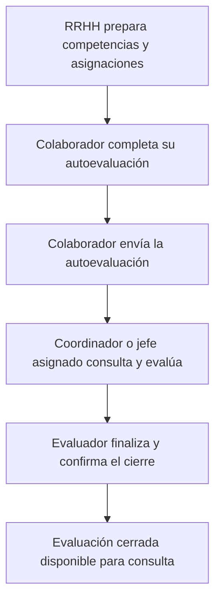

# Primera versión funcional de EDD

## Alcance acordado

La primera versión debe resolver un circuito sencillo y completo: RRHH prepara competencias, áreas, colaboradores y evaluadores; el colaborador realiza su autoevaluación; el coordinador/jefe asignado la recibe en su bandeja, evalúa y cierra el proceso.

Esta definición del usuario tiene prioridad sobre el alcance más amplio de las etapas 1–4 para decidir qué implementar primero. Los documentos anteriores conservan referencias para ampliaciones, pero no agregan requisitos obligatorios a esta primera versión. Se mantiene la escala **1 a 4** y el requisito de esperar el OK explícito del usuario antes de cada commit, sin merge en `main`.

## Datos que proporcionará RRHH

| Dato | Uso |
| --- | --- |
| Competencias genéricas | Criterios comunes que deben evaluarse. Se usará el catálogo que comparta el usuario. |
| Competencias específicas | Criterios adicionales y su correspondencia con el área, puesto o conjunto de colaboradores que RRHH indique. |
| Áreas | Organización y filtro de los participantes. |
| Colaboradores a evaluar | Población explícita del período, identificada por legajo y vinculada a su cuenta. No equivale automáticamente a toda la nómina activa. |
| Evaluadores | Responsable de cada colaborador, vinculado a una cuenta del sistema. El vínculo debe ser explícito; compartir un área no basta para autorizar el acceso. |

La carga deberá detectar legajos o cuentas sin vínculo y asignaciones ambiguas antes de habilitar la autoevaluación. No se sustituirán las competencias pendientes de recibir por ejemplos del antecedente 2025.

## Recorrido

1. **Preparación:** RRHH selecciona el período, las competencias aplicables, el área, el colaborador y su evaluador.
2. **Autoevaluación:** el colaborador ve únicamente su formulario, guarda un borrador y lo envía cuando está completo. Guardar un borrador no lo entrega al evaluador.
3. **Entrega al responsable:** el envío coloca la autoevaluación en la bandeja del evaluador asignado y habilita su trabajo. En esta primera versión, “le llega” se resuelve dentro del módulo; cualquier canal de notificaciones externo requiere definición posterior.
4. **Evaluación:** el coordinador/jefe consulta la autoevaluación enviada y registra sus propios puntajes y comentarios sobre las competencias aplicables. Puede guardar un borrador. Las respuestas de ambas personas permanecen separadas.
5. **Cierre:** el responsable utiliza una acción explícita de finalizar y cerrar, con validación de los campos obligatorios. Se registra autor y fecha; las respuestas cerradas quedan de consulta.

La autoevaluación enviada es requisito para que el responsable evalúe. No se requiere una entrevista ni una etapa de devolución separada para cerrar en esta primera versión. Estas reglas deben validarse en servidor y no depender de botones ocultos.

## Pantallas mínimas

| Usuario | Pantalla | Acciones |
| --- | --- | --- |
| RRHH | Preparación del período | Gestionar los dos grupos de competencias, áreas, participantes y evaluadores. |
| Colaborador | Mi autoevaluación | Guardar borrador, enviar y consultar lo enviado. |
| Coordinador/jefe | Mi equipo | Ver directamente los colaboradores asignados y su avance; acceder a los que enviaron la autoevaluación. |
| Coordinador/jefe | Evaluación del colaborador | Consultar la autoevaluación, guardar sus propias respuestas y finalizar/cerrar. |
| RRHH | Seguimiento | Ver quién falta autoevaluarse, quién espera evaluación y quién finalizó. |

Estados visibles del recorrido: **Autoevaluación pendiente → Autoevaluación en borrador → Pendiente de evaluación del responsable → Evaluación en borrador → Cerrada**. Se conservarán separados el estado de la autoevaluación y el de la evaluación para distinguir quién debe actuar. Al implementarlos, deberán ajustarse el enum y las pantallas iniciales que todavía describen el flujo anterior.

## Simplificaciones

- El instrumento de esta versión incluye competencias genéricas y específicas. Desempeño, conductas y objetivos no se incorporan como bloques independientes obligatorios.
- Entrevista formal, plan de acción, firmas, calibración, reaperturas y reportes estratégicos quedan para ampliaciones.
- Se presentan los puntajes 1–4 por competencia, diferenciando autoevaluación y evaluación. No se inventan ponderaciones ni promedios institucionales mientras sus reglas no estén definidas.
- El responsable accede directamente a su equipo; no elige personas desde un listado institucional general.
- La funcionalidad mínima incluye persistencia real, recuperación de borradores, autorización por asignación, validación, autoría y cierre protegido. Son condiciones de funcionamiento del circuito.

## Estado actual y próximo desarrollo

Actualmente funcionan períodos/instrumentos y la [preparación de población, evaluadores y competencias por área/persona](06-poblacion-y-competencias.md). El editor inicial de instrumentos conserva cinco bloques; las listas funcionales del circuito simple se preparan en el nuevo panel. Mi equipo muestra asignaciones reales. Autoevaluación, respuestas y cierre siguen pendientes.

El incremento de [planificación simple](07-planificacion-simple.md) agrega generales comunes, bibliotecas, aplicación a grupos, rol y servicio de nómina y evaluadores por área. Cada competencia se califica 1–4; no se agregan metas u objetivos separados. La siguiente implementación debe congelar las listas aplicables por persona y completar apertura, respuestas y cierre. Este documento no afirma que el circuito completo ya esté desarrollado.
